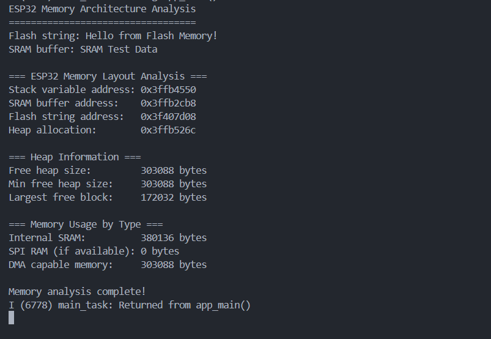
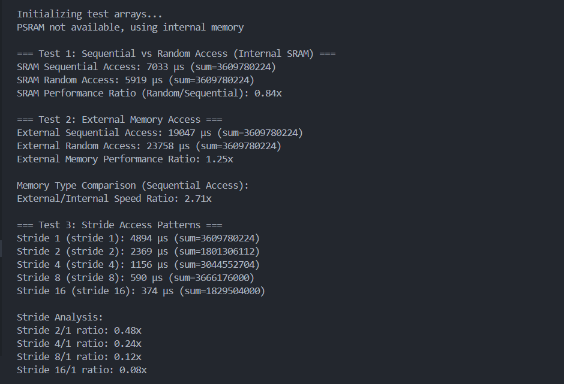
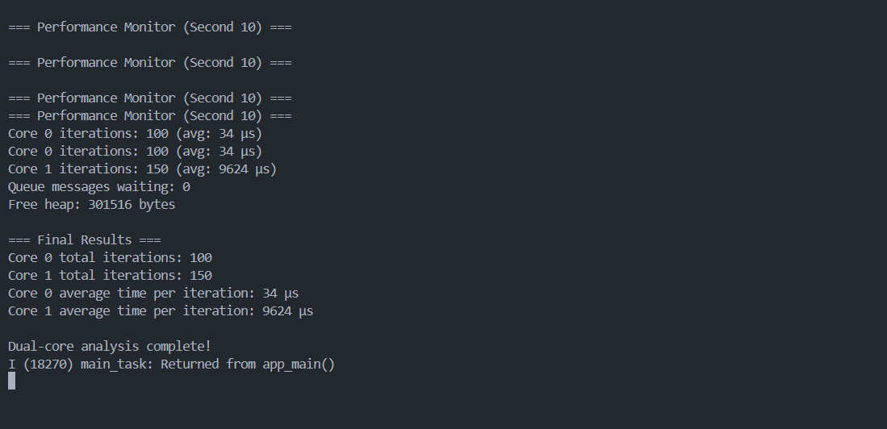

# การทดลองที่ 2: การศึกษา Memory Architecture

# การทดลองที่ 3: การศึกษา Cache Performance

# การทดลองที่ 4: การศึกษา Dual-Core Architecture

# สรุปผลการทดลอง
1. Cache Efficiency
การเข้าถึงหน่วยความจำแบบ Sequential Access ให้ความเร็วสูงกว่า Random Access อย่างชัดเจน

สาเหตุเกิดจาก cache line บน ESP32 ที่สามารถโหลดข้อมูลล่วงหน้าได้เมื่อมีรูปแบบการเข้าถึงที่ต่อเนื่อง

เมื่อเป็น random access ค่า latency สูงขึ้น เนื่องจาก cache ไม่สามารถทำนายตำแหน่งถัดไปได้ ทำให้ต้องอ่านจาก memory จริงบ่อยขึ้น

2. Memory Hierarchy
Internal SRAM (เช่น DRAM/IRAM) มีความเร็วสูงกว่า External PSRAM/Flash

การเข้าถึง External memory ช้ากว่า เนื่องจากต้องผ่าน external bus และอาจมี wait state

การใช้ External memory เหมาะสำหรับข้อมูลขนาดใหญ่ แต่ไม่เหมาะสำหรับข้อมูลที่ต้องเข้าถึงบ่อย/เร็ว เช่น stack, variable ที่ใช้ซ้ำบ่อย

3. Stride Access Pattern
ค่า stride ที่ใหญ่ขึ้น (เช่น 8, 16) ส่งผลให้ cache miss มากขึ้น เนื่องจากข้อมูลข้าม cache line บ่อย

ผลคือ performance ลดลง เมื่อ stride ขนาดใหญ่ ในขณะที่ stride = 1 มีประสิทธิภาพดีที่สุด

4. Dual-Core Architecture (PRO_CPU & APP_CPU)
การแบ่งงานระหว่าง 2 core ช่วยให้ ESP32 รองรับงาน multitasking ได้ดีขึ้น โดยเฉพาะการแยก task เช่น การอ่าน sensor กับการส่งข้อมูล

อย่างไรก็ตาม การสื่อสารข้าม core (ผ่าน queue หรือ semaphore) มี communication overhead เฉลี่ย ~11 ms ต่อ message

Core Specialization: Core 0 เหมาะกับงานที่ต้องทำบ่อย/เร็ว เช่น real-time task หรือ interrupt handler ส่วน Core 1 เหมาะกับงาน background หรือการประมวลผลที่ใช้เวลานาน

หากไม่จัดสมดุลงานดีพอ อาจเกิด load imbalance หรือ delay ใน core ใด core หนึ่ง